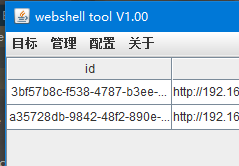
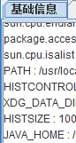
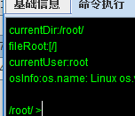
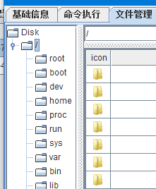

## instros

This src code could be run in IDEA,depends jdk8,gradle4+

Not a simple reverse code,make sure that the code and functions are working done,build pass and tested

This tools is a webshell manager tool ,the main functions are req proxy, server info, rce shell,run terminal,**memory shell**,port forward,msf bind reverse or shell

# think in Godzilla's code design

Godzilla's source code,tested some code and function

thinks [@Godzilla](https://github.com/BeichenDream/Godzilla)

Gave me a lot of ideas,thanks again!

**some function screenshot**

main page

memory shell

controll panel

